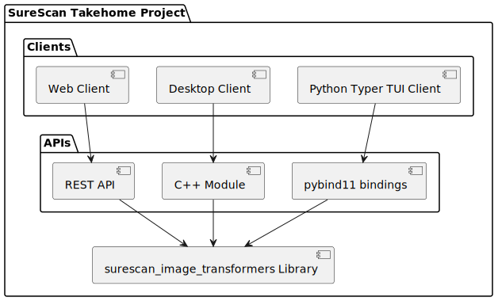
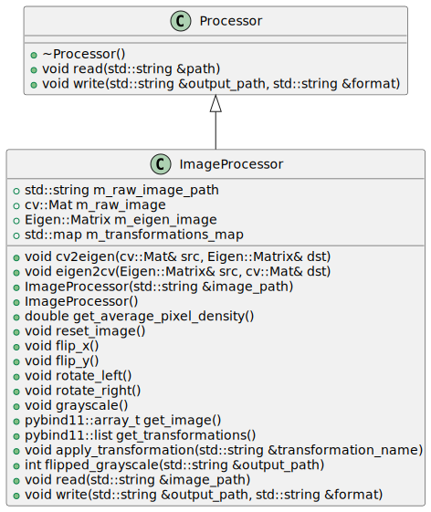
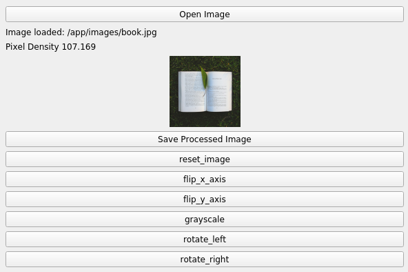

# SureScan Takehome Project - Spenser Millburn

## Overview
This project is a takehome assignment for SureScan. The purpose of the app is to apply image processing/transformations.

## Architecture
- **Core Transformation Logic**: Implemented as a C++ library.
  - Debian package artifacts are published via CI, see Actions tab of this repo.
- **APIs**: The core c++ [eigen/opencv] based library Exposed to both Python and C++ bindings.
- **Clients**: Desktop, CLI, and web (via rest API) clients wrap the library and are built and run as Docker Compose services.

### UML
#### System Design
<table align="center">
  <tr>
    <td></td>
    <td></td>
  </tr>
</table>

- By adopting this pattern, clients dynamically inherit new features from the C++ library without needing code updates.

## Usage

### Quickstart - Launch ALL Clients
- Ensure Docker Compose is installed.
- The desktop client uses X Forwarding, so you may need to run `xhost +`.

```
docker compose up --build
```

### Launching and Using Individual Services
- **DESKTOP C++ QT5 GUI**:
  - Should pop up on the screen. Select an image and follow the on-screen prompts.
  - Command: `docker compose run -it qt_gui_wrapper`
    <table align="center">
      <tr>
        <td></td>
      </tr>
    </table>
- **Python Terminal UI**:
  - Automatically processes images placed in the specified input directory, applying the defined transformations and saving the results to the output directory.
  - Command:
    ```shell
    docker compose run -it python_tui bash -c "python3 /app/python_wrappers/cli.py --input-dir ./images/ --transformation flip_x_axis --transformation grayscale --output-dir ./output"
    ```
  - Man Page:  
    ```
    [I] ~/e/r/surescan-take-home ❯❯❯ docker compose run -it python_tui bash -c "python3 /app/python_wrappers/cli.py --help"                          master ✭ ◼

    Usage: cli.py [OPTIONS]                                                                                                                                  
                                                                           
    ╭─ Options ───────────────────────────────────────────────────────────╮
    │ *  --transformation            TEXT  Transformation(s) to apply,    │
    │                                      options are ['flip_x_axis',    │
    │                                      'flip_y_axis', 'grayscale',    │
    │                                      'reset_image', 'rotate_left',  │
    │                                      'rotate_right']. NOTE: you may │
    │                                      pass multiple transformations  │
    │                                      like --transformation flip_x   │
    │                                      --transformation grayscale     │
    │                                      [default: None]                │
    │                                      [required]                     │
    │ *  --input-dir                 TEXT  Directory containing input     │
    │                                      images                         │
    │                                      [default: None]                │
    │                                      [required]                     │
    │    --output-dir                TEXT  Directory to save transformed  │
    │                                      images                         │
    │                                      [default: ./output]            │
    │    --install-completion              Install completion for the     │
    │                                      current shell.                 │
    │    --show-completion                 Show completion for the        │
    │                                      current shell, to copy it or   │
    │                                      customize the installation.    │
    │    --help                            Show this message and exit.    │
    ╰─────────────────────────────────────────────────────────────────────╯
    ```

  - The transformed images appear in the `./output` directory on the host.
- **Typescript React Web GUI**:
  - Browse to [http://localhost:3000](http://localhost:3000) and follow on-screen prompts. You may either upload a single image or a tarball of images.
- **REST API**:
  - See RESTful API documentation at [http://localhost:8000/docs](http://localhost:8000/docs).

## CI/BUILD
- The CMake build is executed as a GitHub Actions workflow.
- Critical parts of the code are unit tested during a stage in the pipeline.
- The workflow ensures that the code is built and tested automatically with each push or pull request to the repository.

### Artifacts
- The transformer library, GUI, and all test results output are available as CI artifacts.

## Additional Information
- Built with love by Spenser Millburn.
